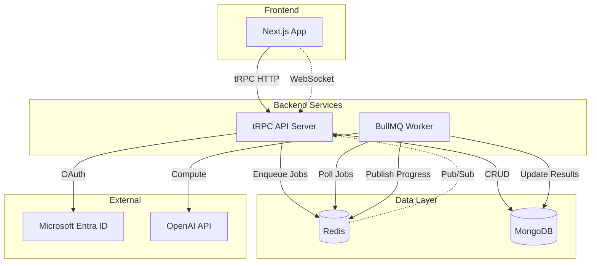
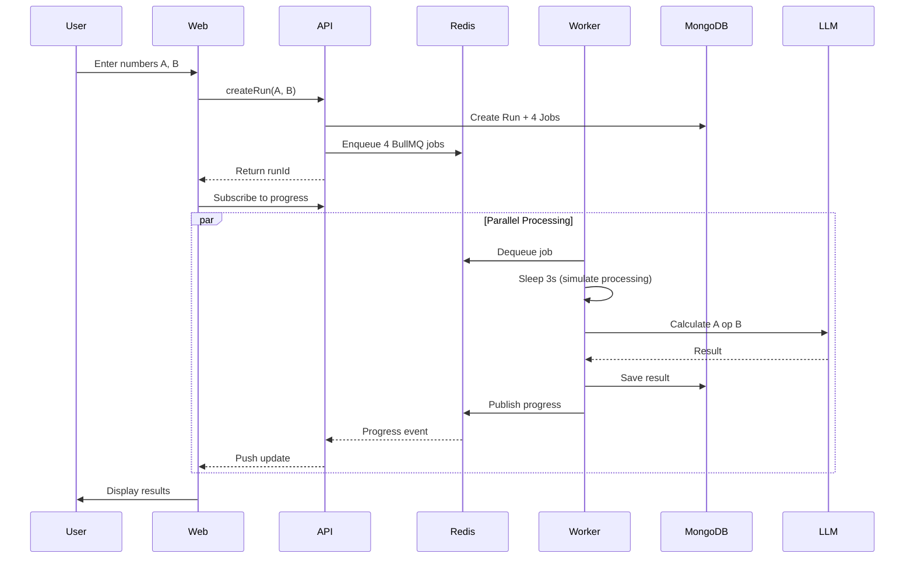

# Worker App - Queue/Worker Computation System

A full-stack application demonstrating a queue/worker architecture with real-time updates, LLM-powered computations, and modern authentication.

## Overview

This application allows users to input two numbers (A and B) and processes 4 computational jobs (A+B, A-B, A\*B, A/B) through a scheduler-worker system. The system handles tasks asynchronously and displays real-time updates via WebSocket subscriptions.

### Key Features

- **Parallel Job Processing**: 4 concurrent workers process jobs simultaneously
- **LLM-Powered Computations**: OpenAI API performs calculations with deterministic fallback
- **Real-time Updates**: WebSocket subscriptions for live progress tracking
- **Microsoft Entra ID Auth**: Secure OAuth authentication
- **Type-Safe APIs**: End-to-end type safety with tRPC and Zod

## Architecture



## Data Flow



## Tech Stack

| Category       | Technology                                    |
| -------------- | --------------------------------------------- |
| **Frontend**   | Next.js 15, React 19, Tailwind CSS, shadcn/ui |
| **Backend**    | Node.js, tRPC, Better Auth                    |
| **Queue**      | BullMQ, Redis                                 |
| **Database**   | MongoDB (Prisma ORM)                          |
| **Auth**       | Microsoft Entra ID (Azure AD)                 |
| **LLM**        | Z.AI API (GLM-4.7)                            |
| **Deployment** | Railway, Docker                               |
| **CI/CD**      | GitHub Actions                                |
| **Testing**    | Vitest                                        |

## Project Structure

```
WorkerApp/
├── apps/
│   ├── web/          # Next.js frontend
│   ├── api/          # tRPC API server
│   └── worker/       # BullMQ worker process
├── packages/
│   ├── api/          # Shared tRPC routers & types
│   ├── db/           # Prisma schema & client
│   ├── queue/        # BullMQ queue definitions
│   ├── llm/          # OpenAI client & parsing
│   └── ui/           # Shared UI utilities
├── tasks/            # Task documentation
└── .github/workflows # CI/CD pipelines
```

## Getting Started

### Prerequisites

- Node.js >= 20
- pnpm 9.x
- Docker (for local Redis/MongoDB)
- MongoDB Atlas account (or local MongoDB)
- OpenAI API key
- Microsoft Entra ID app registration

### Local Development

1. **Clone and install**:

   ```bash
   git clone <repository-url>
   cd WorkerApp
   pnpm install
   ```

2. **Start local services**:

   ```bash
   docker-compose up -d
   ```

3. **Configure environment**:

   ```bash
   cp env.example .env
   # Edit .env with your credentials
   ```

4. **Generate Prisma client**:

   ```bash
   pnpm --filter @worker-app/db db:generate
   pnpm --filter @worker-app/db db:push
   ```

5. **Start all services**:

   ```bash
   pnpm dev
   ```

   This starts:
   - Web: http://localhost:3000
   - API: http://localhost:4000
   - Worker: Background process

### Running Tests

```bash
pnpm test
```

## Environment Variables

| Variable              | Description                                               | Required |
| --------------------- | --------------------------------------------------------- | -------- |
| `MONGODB_URI`         | MongoDB connection string                                 | Yes      |
| `REDIS_URL`           | Redis connection string                                   | Yes      |
| `LLM_API_KEY`         | Z.AI API key                                              | Yes      |
| `LLM_BASE_URL`        | LLM API base URL (default: https://api.z.ai/api/paas/v4/) | No       |
| `LLM_MODEL`           | Model to use (default: glm-4.7)                           | No       |
| `AUTH_SECRET`         | Better Auth secret (32+ chars)                            | Yes      |
| `ENTRA_CLIENT_ID`     | Azure App Client ID                                       | Yes      |
| `ENTRA_CLIENT_SECRET` | Azure App Client Secret                                   | Yes      |
| `ENTRA_TENANT_ID`     | Azure Tenant ID                                           | Yes      |
| `NEXT_PUBLIC_APP_URL` | Frontend URL                                              | Yes      |
| `NEXT_PUBLIC_API_URL` | API URL                                                   | Yes      |
| `NEXT_PUBLIC_WS_URL`  | WebSocket URL                                             | Yes      |

## Design Decisions

### Why Turbo Monorepo?

- **Shared types**: Single source of truth for TypeScript types across all services
- **Efficient builds**: Turbo caches build outputs, speeding up CI/CD
- **Simplified dependency management**: One lockfile, consistent versions

### Why tRPC + Zod?

- **End-to-end type safety**: Types flow from API to frontend automatically
- **Runtime validation**: Zod schemas validate data at runtime
- **WebSocket subscriptions**: Built-in support for real-time updates

### Why BullMQ?

- **Reliable**: Redis-backed with automatic retries and failure handling
- **Concurrent**: Configurable worker concurrency for parallel processing
- **Observable**: Built-in events for job lifecycle tracking

### Why LLM + Fallback?

- **Demonstrates LLM integration**: Shows how to integrate AI into a workflow
- **Reliability**: Deterministic fallback ensures correct results even if LLM fails
- **Validation**: Zod validates LLM responses before use

### Why Better Auth?

- **Modern OAuth**: Easy integration with multiple providers
- **Prisma adapter**: Works seamlessly with MongoDB
- **Type-safe**: Full TypeScript support

## Troubleshooting

### Worker not processing jobs

1. Check Redis connection: `redis-cli ping`
2. Verify `REDIS_URL` environment variable
3. Check worker logs for errors

### Authentication issues

1. Verify Entra ID credentials
2. Check redirect URI in Azure portal matches: `{API_URL}/api/auth/callback/microsoft`
3. Ensure `AUTH_SECRET` is set

### Database connection errors

1. Verify `MONGODB_URI` format
2. Check MongoDB Atlas network access (whitelist IP or allow all)
3. Run `pnpm --filter @worker-app/db db:push` to sync schema

### Real-time updates not working

1. Check WebSocket connection in browser devtools
2. Verify `NEXT_PUBLIC_WS_URL` points to API server
3. Check for CORS issues in API logs

## License

MIT

